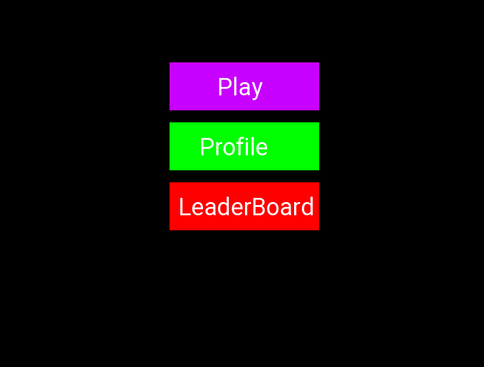
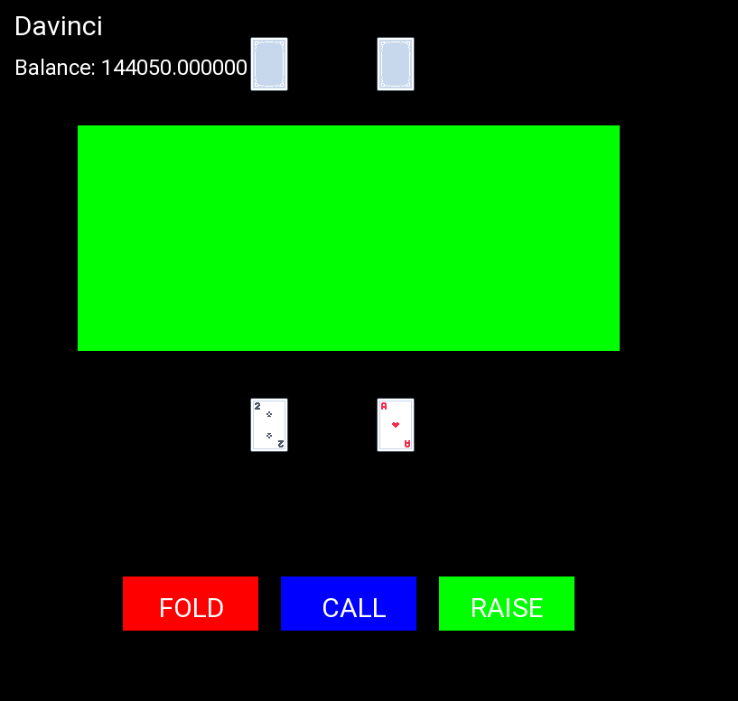
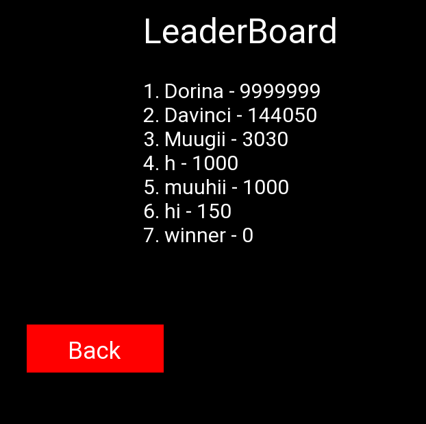
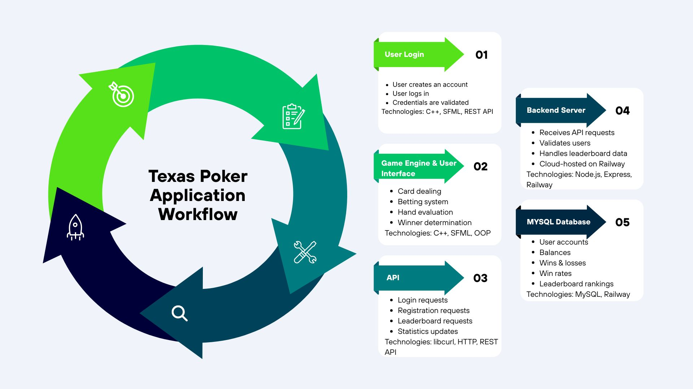
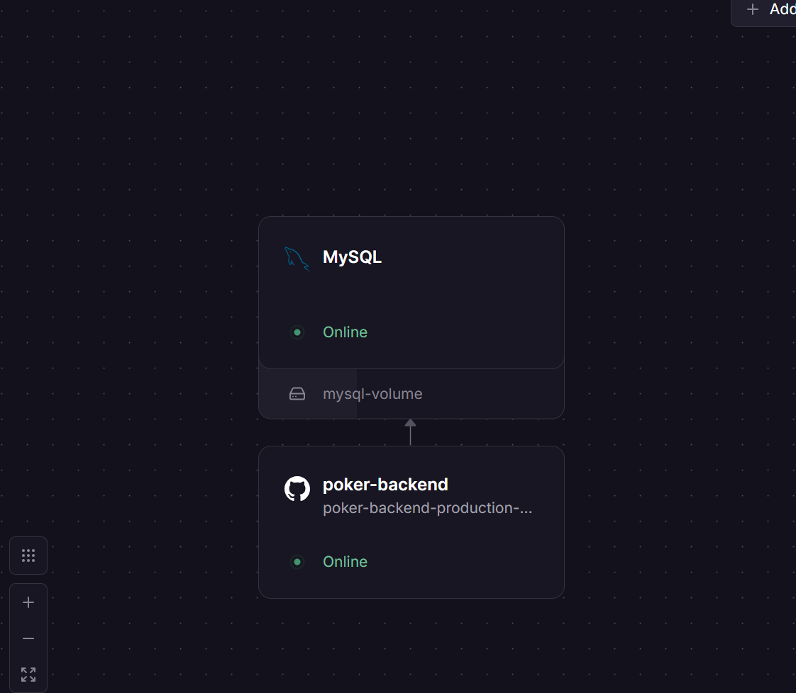
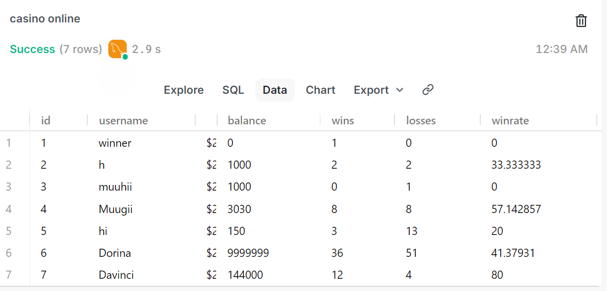
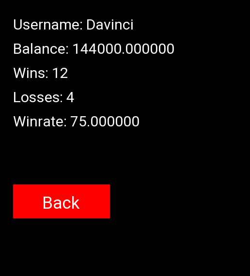

# 🎰 Texas Poker

## 🚀 Overview

Texas Poker is a full-stack Texas Hold'em Poker application developed using C++, SFML, Node.js, Express, and MySQL.

The project combines desktop game development with cloud-based backend infrastructure, allowing players to create accounts, authenticate, save progress, and compete through an online leaderboard. The backend is deployed on Railway and connected to a cloud-hosted MySQL database, enabling persistent player statistics and account management across sessions.

This project demonstrates software engineering principles including client-server architecture, API integration, database design, deployment, and object-oriented programming.

---

## 🧠 Core Features

### ♠️ Texas Hold'em Gameplay

* Complete Texas Hold'em game flow
* Multi-player support
* Betting system
* Pot management
* Deck generation and shuffling
* Turn management

### 🃏 Advanced Hand Evaluation

* High Card
* Pair
* Two Pair
* Three of a Kind
* Straight
* Flush
* Full House
* Four of a Kind
* Straight Flush
* Royal Flush

### 🌐 Online Infrastructure

* User registration system
* User authentication and login
* Persistent player profiles
* Cloud-hosted database
* Online leaderboard
* Progress synchronization

### 💾 Persistent Player Data

* Player balance tracking
* Win/loss statistics
* Win rate calculation
* Account-based progression

---

## 🏗️ Architecture

### Client (C++ / SFML)

Responsible for:

* User Interface
* Game Logic
* Player Interaction
* API Communication

### Backend (Node.js / Express)

Responsible for:

* User Authentication
* Database Operations
* Leaderboard Management
* Progress Updates

### Database (MySQL)

Stores:

* User Accounts
* Password Credentials
* Player Statistics
* Balance Information
* Leaderboard Data

### Cloud Infrastructure

* Backend deployed on Railway
* Cloud-hosted MySQL database
* Internet-connected client-server communication

---

## ⚙️ Technologies Used

### Frontend

* C++
* SFML

### Backend

* Node.js
* Express.js

### Database

* MySQL

### Cloud & Deployment

* Railway
* REST APIs

### Development Tools

* Git
* GitHub
* Inno Setup

---

## 📂 Project Structure

API/ → Client-server communication

BackEnd/ → Core game systems

Core/ → Engine functionality

Screens/ → User interface screens

Source/ → Application entry points

Assets/ → Fonts, textures, and resources

poker-server/ → Node.js backend services

Installer/ → Application installer configuration

---

## 🎯 Learning Outcomes

This project provided hands-on experience with:

* Object-Oriented Programming
* Full-Stack Development
* REST API Design
* Database Integration
* Cloud Deployment
* User Authentication
* Software Packaging and Distribution
* Git Version Control
* Debugging and Software Maintenance

---

## 📸 Screenshots

### Login System

User authentication and account registration system connected to a cloud-hosted backend.

### Gameplay

Texas Hold'em gameplay featuring betting mechanics, pot management, and hand evaluation.

### Leaderboard

Online leaderboard synchronized with player statistics stored in the database.

### System Architecture

Full-stack architecture connecting the C++ client, backend API, and cloud-hosted database.

### Railway Deployment

Backend services and database deployed on Railway cloud infrastructure.

### Database

Persistent storage of user accounts, balances, win/loss statistics, and leaderboard data.

### Profile System

Account management system integrated with the backend infrastructure, allowing players to view their balance, statistics, win rate, and persistent gameplay data stored in the MySQL database.

## 📥 Download

The game can be downloaded and installed through the project's itch.io release page.
Download link: https://irmvvn-d-vinci.itch.io/texas-poker

---

## 👨‍💻 Author

Developed by Irmuun Naranbaatar as a full-stack software engineering project combining game development, backend infrastructure, cloud deployment, and database integration.
